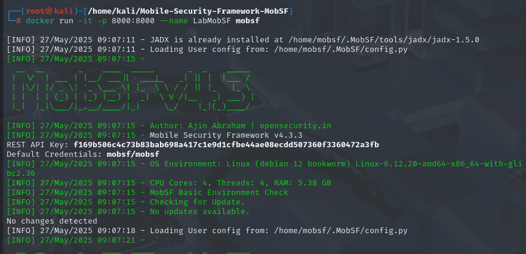

# PPS-Unidad3Actividad28-David
## Análisis Dinámico de APK con MobSF y Genymotion: InsecureBankv2

#### Obtener InsecureBankv2

InsecureBankv2 es una aplicación vulnerable desarrollada con fines educativos para practicar análisis y explotación de fallos en apps móviles.

1. Clonamos el repositorio oficial:


2. Descargamos el -apk precompilado.


#### Instalar MobSF

Podemos ejecutar MobSF localmente utilizando Docker o de forma manual. A continuación, se muestra el método recomendado (Docker):

Seguimos estos pasos:

``` 
git clone https://github.com/MobSF/Mobile-Security-Framework-MobSF.git
cd Mobile-Security-Framework-MobSF
docker build -t mobsf . 
```

Finalmente levantamos el contenedor:




#### Instalar Genymotion

Genymotion es un emulador de Android que permite ejecutar máquinas virtuales de diferentes versiones y dispositivos. Es muy útil para realizar pruebas de seguridad móvil en entornos controlados.

Creando una cuenta en https://www-v1.genymotion.com/account/create/ y siguiendo los pasos para la descarga y configuración de un emulador Android arrancamos el sistema operativo.


Aquí podemos ver la interfaz gráfica del dispositivo.


También podemop ver la ip.


Vemos que tenemos conexión mutua del kali al emulador.


¡¡¡IMPORTANTE!!! 
Yo no he realizado este ejercicio con el .apk de InsecureBankv2, lo he realizado con pivaa.apk.

#### Poner en marcha el laboratorio

Levantamos MobSF: tendremos que cambiar la ip del dispositivo emulado asociada a la variable MOBSF_ANALYZER_IDENTIFIER, en el comando docker de abajo.


##### Análisis dinámico de la aplicación

Accedemos a MobSF y realizamos la operación del análisis dinámico.


Vemos como esta conectado correctamente con nuestro dispositivo virtual.


Vemos las aplicaciones detectadas por el analizador dinámico. Como nos interesa MobSF, pulsamos en ella en Iniciar Análisis dinámico


MobSF lanzará la app en el emulador y empezará a registrar comportamiento, tráfico, uso de permisos, etc.

El informe dinámico incluirá información como:

- Permisos en tiempo de ejecución.
- Tráfico de red y endpoints detectados.
- Interacciones con el sistema.
- Análisis de logs, broadcasts, servicios, etc.
- Captura de tráfico HTTPS (si está configurado con proxy o CA).


FIN